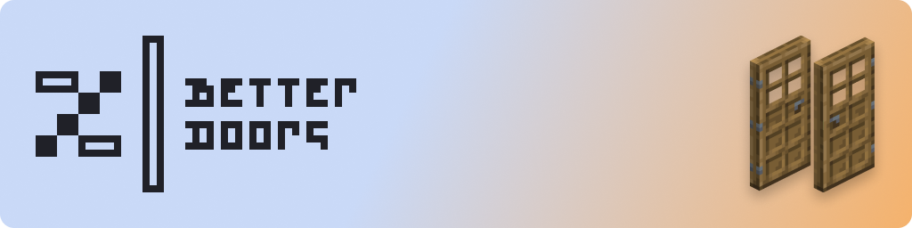

# Better Doors
 

## About

Better Doors is my personal solution for what doors should be like in Minecraft. They have a more polished look with non-mirrored textures (meaning light shading is top-left to bottom-right) as they should, and have proper side textures to clarify which side the hinges are on.

## Additional Addon's

- 3D doors Addon **(Out of Date)**
- Programmer Art Addon **(Out of Date)**

## Credits & Acknowledgements 

- `none yet`

---

## Contributing

If you'd like to contribute to the development of Better Doors you can do so in two ways:

1. If you know what you are doing feel free to create a new issue with your suggested additions, changes, improvements, and/or updates. 
2. If you are unfamiliar with GitHub, you can upload your suggested contribution on the discord server (in accordance with the guidelines) and It'll be uploaded as an issue on your behalf.

I'll then review and filter the suggestions, and if they match with the vision of the project, I'll merge them into the pack.

> [!NOTE]
> Same applies for any addons you wish to make. 

---

## Links

 
	
 
		
	

	
 
		
	

	
 
		
	

---

## License and Use

This work is licensed under <a href="https://creativecommons.org/licenses/by-nc-sa/4.0/?ref=chooser-v1" target="_blank" rel="license noopener noreferrer" style="display:inline-block;">CC BY-NC-SA 4.0</a>

A **lot** of work goes into Resource Packs. 
Please respect the wishes of the authors, and consult with them before taking any action concerning their work.

Thank you Kindly.
